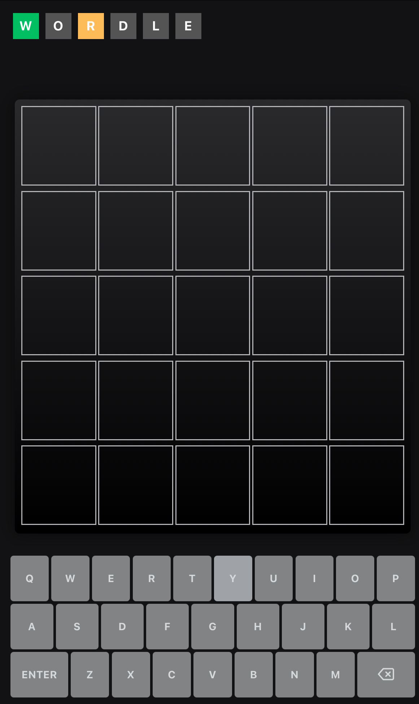

<div align="center">
  
</div>

# WORDLE GAME - REACT

## Overview

<div align="center">
  
</div>

## The Challenge

Create simple version of the game Wordle implemented in Vite using React and TypeScript including the following requirements:

- All rules are implemented.
- Include a unit test of the word guessing routine that validates at least the last two
  rules.
- Your code cannot perform any network communication.
- The word list array must be stored in a data or words file as constant .
- The unit test may use a hard-coded word list.
- Provide a quick introduction to the game for the user.

## Game Rules

- You have five guesses
- All words are 5 length
- The guesser gets the feedback about any letters in their guess that are in the right
  position with a green highlight, while letters that are in the word but not in the
  correct position will get a yellow outline.
- The yellow highlight will not show up if you have more of a letter than in the correct
  answer. - Example: if the the correct word is WATER and you guess OTTER, the first T
  must not get a yellow highlight.

### Built With

- Vite
- React
- TypeScript

## Links

- Live Site URL: [github page](https://nicorithner.github.io/wordle-react-nico-rithner/)

## Install locally

### Clone Project

To install locally clone this repo. In your terminal type:

`git clone <git@github.com>:nicorithner/wordle-react-nico-rithner.git`

### Install Dependencies

To install dependencies navigate to the project directory in your terminal and install:

```bash
cd wordle-react-nico-rithner
yarn install
```

### Run project

To run the project you can type in the terminal:

`yarn dev`

and then navigate in the browser to the local host address displayed in the terminal. For example:

```
Local:   <http://localhost:5173/wordle-react-nico-rithner/>
```

### Tests

To test the logic you can run the test in the terminal with the command:

`yarn test`

To see the test details please inspect the files under the tests directory.

## Screenshots

### Mobile Views

### Mobile Start Screen

<div align="center">

  

</div>

### Mobile Game Beginning Screen

<div align="center">

  

</div>

### Mobile Mid Game Screen

<div align="center">

  

</div>

### Mobile Win Screen

<div align="center">

  

</div>

### Desktop Views

### Desktop Start Screen

<div align="center">

  

</div>

### Desktop Game Beginning Screen

<div align="center">

  

</div>

### Desktop Mid Game Screen

<div align="center">

  

</div>

### Desktop Win Screen

<div align="center">

  

</div>
